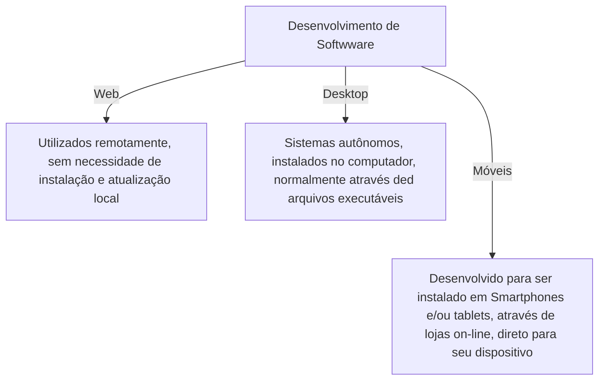

# Desenvolvimento moderno de Softwware

##### Professor: Denilson Bonatti 

##### [Material de apoio](https://academiapme-my.sharepoint.com/:p:/g/personal/nubia_dio_me/EYHcjptuOoNPs4qzd2upfmwBaLoG_FfSdzZH3zJiBvABiw?rtime=AYC6zm2z2kg)

------

##### Modelo Cliente - Servidor: 

A imagem acima, representa o que é o modelo cliente-Servido.

Exemplo: Um aplicativo é um requerente que busca a informação no servidor.

## :question: E quem são os profissionais que desenvolvem um Software?

- **UX Designer** - Focado na experiência do usuário e na usabilidade de forma que proporcione uma satisfação na interação.

  > :wrench: Figma, Adobe XP,...

- **UI Designer** - Entende de padrões visuais. Focado em cores, tipografia, micro interações e estilos. 

  > :wrench: Photoshop, CorelDRAW,...

- **Front End** - Desenvolve por meio de código a parte visual de um site ou app, ou seja, o que conseguimos interagir.

  > :man_technologist: HTML, CSS e JavaScript.

- **Back End** - Responsável pela ponte entre dados que vem do navegador rumo ao banco de dados e vice-versa. Usuário final não possui acesso direto.

  > :woman_technologist: JAVA, PHP e C#.

- **Full Stack** - Trabalha tanto como Front End, quanto Back End. Detém o conhecimento de todo o processo.

  > :woman_technologist: Ampla variedade de linguagens de programação.

- **Quality Assurance (QA)** - Conhecimento sobre as atividades do projeto e perfil analítico. Verifica se os padrões de qualidade estão sendo atendidos.

### :bulb: Onde os códigos são criados?

Em um **IDE**! :arrow_right: Software para criar aplicações que combina ferramentas comuns de desenvolvimento em uma única interface gráfica do usuário (GUI).

### :bulb: O que são frameworks?

É um **facilitador**! Traz soluções já pré-definidas. Serve para agilizar o processo do desenvolvedor. Ex.: Angular, Laravel e Vue.

------

# API 

Intermediário de software, que permite que dois aplicativos conversem entre si.

------

#### NUVEM PÚBLICA X NÚVEM PRIVADA:

**Nuvem privada**:

- É necessário espaço físico
- Mão de obra especializada
- Custo alto
- Menor escalabilidade

**Nuvem pública**

Sistema de armazenamento de dados via internet.

-  Menor custo
- Facilidade de contratação
- Escalabilidade
- melhor performance 

:cloud: Especialista responsável pela infraestrutura de nuvem oferecida ao cliente = **CLOUD COMPUTING**

------

### MOBILE :mobile_phone_off:

**ANDROID** - Java e ou Kotlin

**IOS** - Swift

Possibilidade de utilizar um <strong>desenvolvimento híbrido</strong> (web), porém é encapsulado, falta recursos.

**FRAMEWORKS** - 

- Android Studio ( Android)
- X Code ( IOS)
- Flutter, react native ( Desenvolvimento híbrido).

